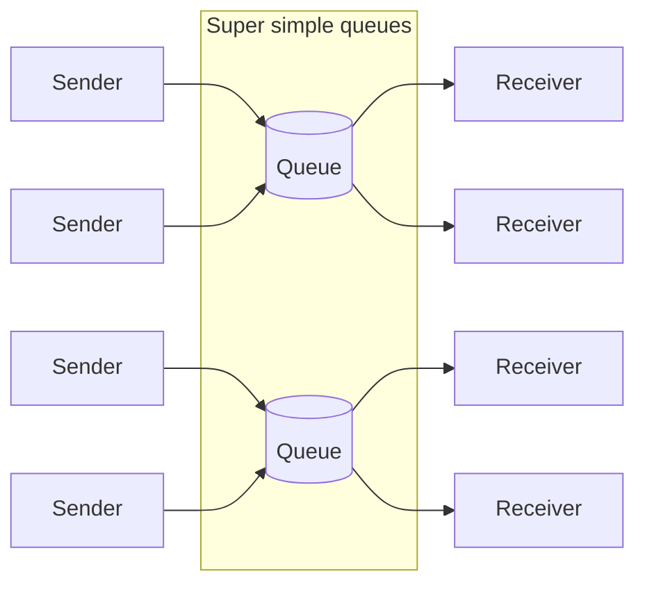
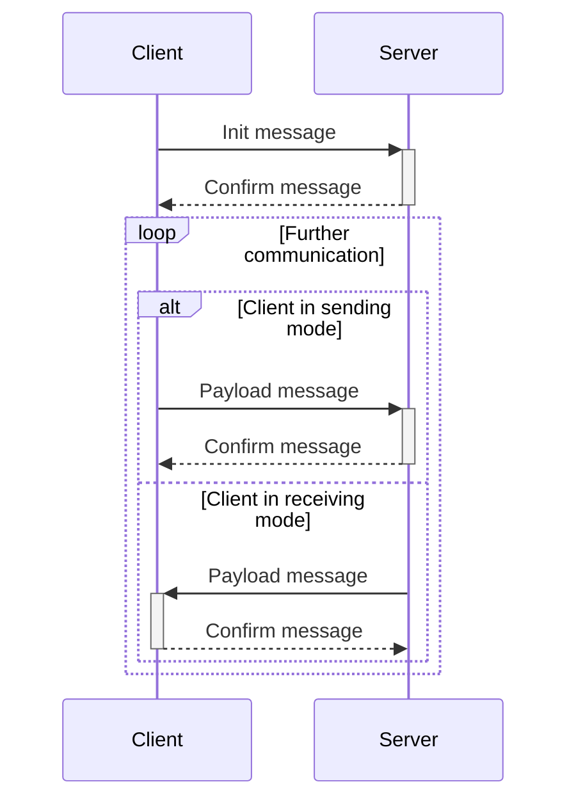

# Super simple queues

Super simple queuing system.

## An example of the system operation in the diagram

## Interacting with the system via TCP

### Message types and their structure

Three types of messages are used to interact with the system:

- Init
- Payload
- Confirm

Each message begins with a one-byte header that defines the message type.

#### Message type "Init"

<table>
<tr>
<td align="center">Type</td>
<td align="center">Operating mode</td>
<td align="center">Queue key length</td>
<td align="center">Queue key</td>
</tr>
<tr>
<td align="center">1 byte (<code>uint8</code>)</td>
<td align="center">1 byte (<code>uint8</code>)</td>
<td align="center">1 byte (<code>uint8</code>)</td>
<td align="center">N bytes (<code>utf8</code>)</td>
</tr>
</table>

Init message type is always `0x01`. The client's operating mode can be either `0x00` or `0x01`, where `0x00` is the
receiving mode and `0x01` is the sending mode.

Example:

<table>
<tr>
<td align="center">Type</td>
<td align="center">Operating mode</td>
<td align="center">Queue key length</td>
<td align="center">Queue key</td>
</tr>
<tr>
<td align="center"><code>0x01</code></td>
<td align="center"><code>0x01</code></td>
<td align="center"><code>0x04</code></td>
<td align="center"><code>test</code></td>
</tr>
</table>

#### Message type "Payload"

<table>
<tr>
<td align="center">Type</td>
<td align="center">Data length</td>
<td align="center">Data</td>
</tr>
<tr>
<td align="center">1 byte (<code>uint8</code>)</td>
<td align="center">4 bytes (<code>uint32</code>)</td>
<td align="center">N bytes (<code>utf8</code>)</td>
</tr>
</table>

Payload message type is always `0x02`.

Example:

<table>
<tr>
<td align="center">Type</td>
<td align="center">Data length</td>
<td align="center">Data</td>
</tr>
<tr>
<td align="center"><code>0x02</code></td>
<td align="center"><code>0x00000009</code></td>
<td align="center"><code>some data</code></td>
</tr>
</table>

#### Message type "Confirm"

<table>
<tr>
<td align="center">Type</td>
</tr>
<tr>
<td align="center">1 byte (<code>uint8</code>)</td>
</tr>
</table>

Confirm message type is always `0x03`.

Example:

<table>
<tr>
<td align="center">Type</td>
</tr>
<tr>
<td align="center"><code>0x03</code></td>
</tr>
</table>