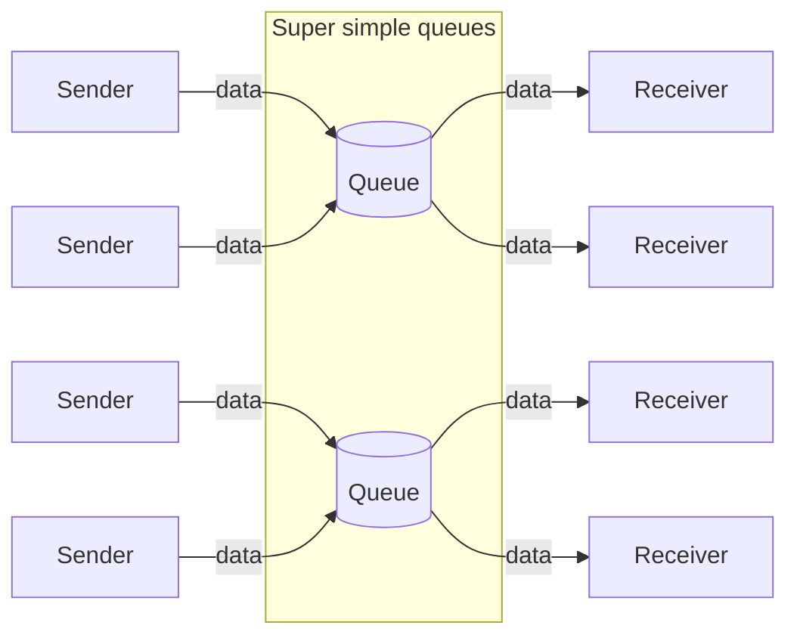
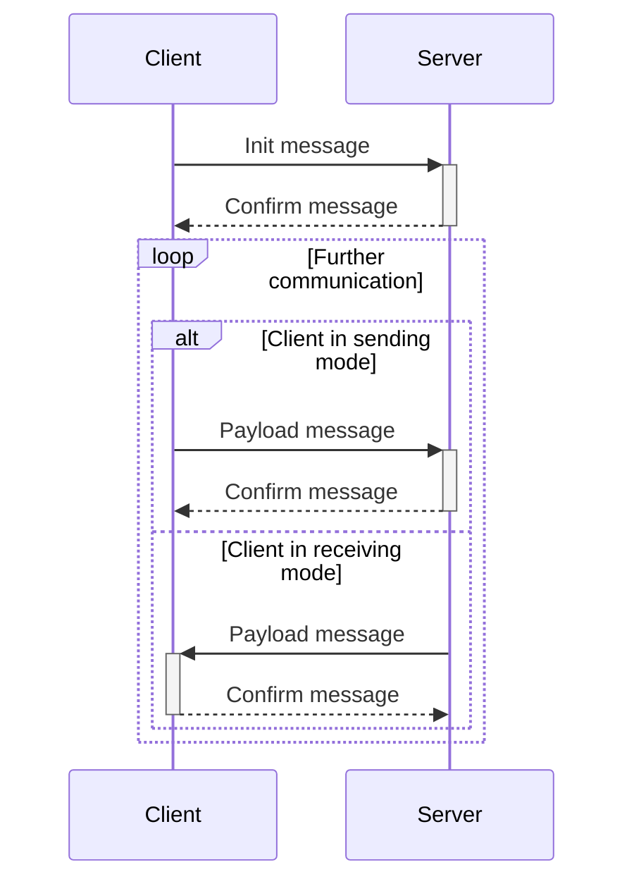

# Super simple queues

[](https://github.com/stepan-0x28/super-simple-queues/actions/workflows/ci.yml)

A super simple queuing system for sending data from one or more senders to one or more queues, with the ability to
receive that data by one or more receivers.

### An example of the system operation in the diagram



## Quick start

### Start with Docker

```bash
docker build -t super-simple-queues .
```

```bash
docker run -d --name super-simple-queues \
    -e TCP_PORT=8888 -e HTTP_PORT=8080 -e QUEUE_CHUNK_SIZE=1024 \
    -e LOGGING_LEVEL=Info -e TCP_CONN_BUFFER_SIZE=256 \
    -p 8888:8888 -p 8080:8080 \
  super-simple-queues
```

Or use Docker Compose, but first copy the `.env.example` file to the `.env` file and adjust the values as needed:

```bash
docker compose up -d
```

### Usage

First you need to [**create a queue via HTTP**](#creating-a-queue), then you
can [**send and/or receive data via TCP**](#interacting-with-the-system-via-tcp).

## Interacting with the system via HTTP

### Creating a queue

**request**&nbsp;&nbsp;&nbsp;&nbsp;`POST /queues/{key}`  
**response**&nbsp;`201` `{"message":"the queue has been created"}`

### Getting information about the queue

**request**&nbsp;&nbsp;&nbsp;&nbsp;`GET /queues/{key}`  
**response**&nbsp;`200` `{"items_count":0}`

### Getting information about all queues

**request**&nbsp;&nbsp;&nbsp;&nbsp;`GET /queues`  
**response**&nbsp;`200` `{"queues_count":1,"queues_info":{"example-queue":{"items_count":0}}}`

### Deleting a queue

**request**&nbsp;&nbsp;&nbsp;&nbsp;`DELETE /queues/{key}`  
**response**&nbsp;`200` `{"message":"the queue was successfully deleted"}`

## Interacting with the system via TCP



Three types of messages are used to interact with the system:

- Init
- Payload
- Confirm

Each message begins with a one-byte header that defines the message type.

### Message type "Init"

<table>
<tr>
<td align="center">Type</td>
<td align="center">Operating mode</td>
<td align="center">Queue key length</td>
<td align="center">Queue key</td>
</tr>
<tr>
<td align="center">1 byte<br>(<code>uint8</code>)</td>
<td align="center">1 byte<br>(<code>uint8</code>)</td>
<td align="center">1 byte<br>(<code>uint8</code>)</td>
<td align="center">N bytes<br>(<code>utf8</code>)</td>
</tr>
</table>

Init message type is always `0x01`. The client's operating mode can be either `0x00` or `0x01`, where `0x00` is the
receiving mode and `0x01` is the sending mode.

Example:

<table>
<tr>
<td align="center">Type</td>
<td align="center">Operating mode</td>
<td align="center">Queue key length</td>
<td align="center">Queue key</td>
</tr>
<tr>
<td align="center"><code>0x01</code></td>
<td align="center"><code>0x01</code></td>
<td align="center"><code>0x04</code></td>
<td align="center"><code>test</code></td>
</tr>
</table>

### Message type "Payload"

<table>
<tr>
<td align="center">Type</td>
<td align="center">Data length</td>
<td align="center">Data</td>
</tr>
<tr>
<td align="center">1 byte<br>(<code>uint8</code>)</td>
<td align="center">4 bytes<br>(<code>uint32</code>)</td>
<td align="center">N bytes<br>(<code>utf8</code>)</td>
</tr>
</table>

Payload message type is always `0x02`.

Example:

<table>
<tr>
<td align="center">Type</td>
<td align="center">Data length</td>
<td align="center">Data</td>
</tr>
<tr>
<td align="center"><code>0x02</code></td>
<td align="center"><code>0x00000009</code></td>
<td align="center"><code>some data</code></td>
</tr>
</table>

### Message type "Confirm"

<table>
<tr>
<td align="center">Type</td>
</tr>
<tr>
<td align="center">1 byte<br>(<code>uint8</code>)</td>
</tr>
</table>

Confirm message type is always `0x03`.

Example:

<table>
<tr>
<td align="center">Type</td>
</tr>
<tr>
<td align="center"><code>0x03</code></td>
</tr>
</table>