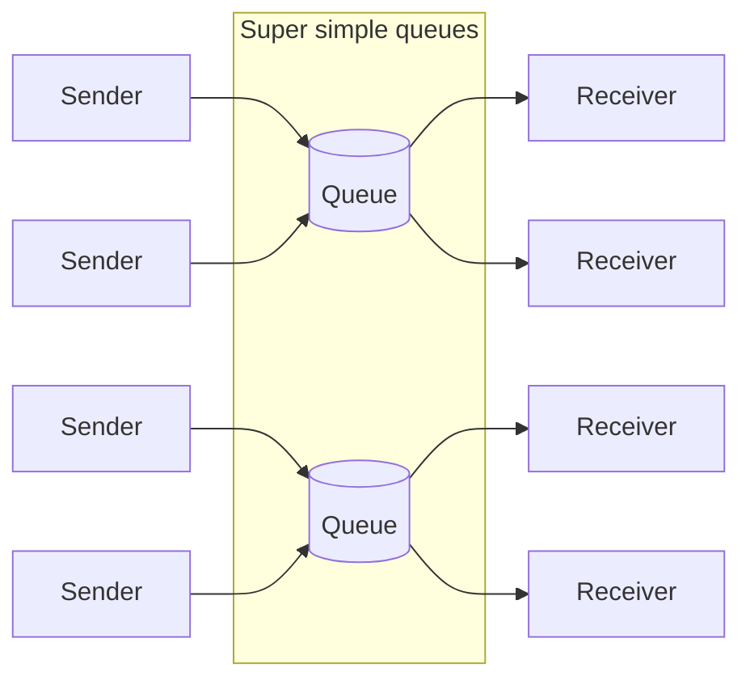

# Super simple queuing system

## An example of the system operation in the diagram

```mermaid
flowchart LR
    Queue1[(Queue)]
    Queue2[(Queue)]
    Sender1[Sender]
    Sender2[Sender]
    Sender3[Sender]
    Sender4[Sender]
    Receiver1[Receiver]
    Receiver2[Receiver]
    Receiver3[Receiver]
    Receiver4[Receiver]

    subgraph Super simple queues
        Queue1
        Queue2
    end

    Sender1 & Sender2 --> Queue1 --> Receiver1 & Receiver2
    Sender3 & Sender4 --> Queue2 --> Receiver3 & Receiver4
```